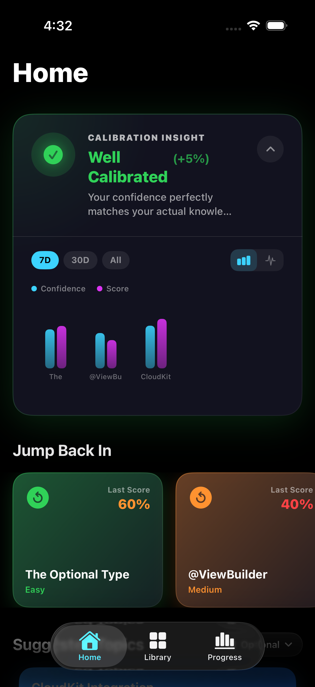
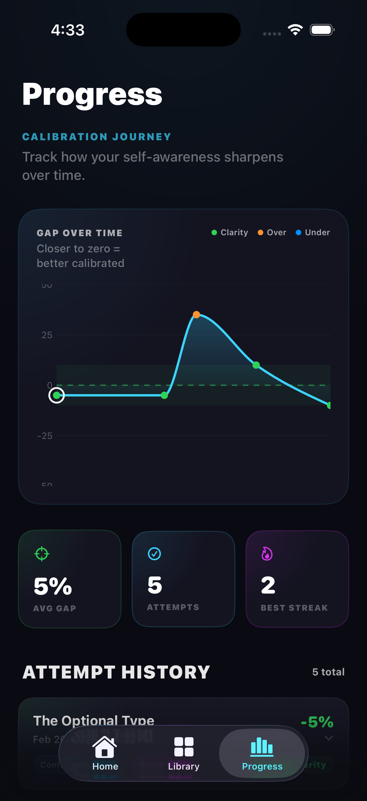
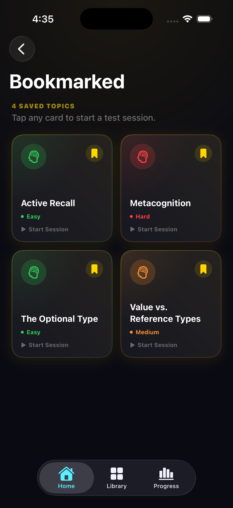
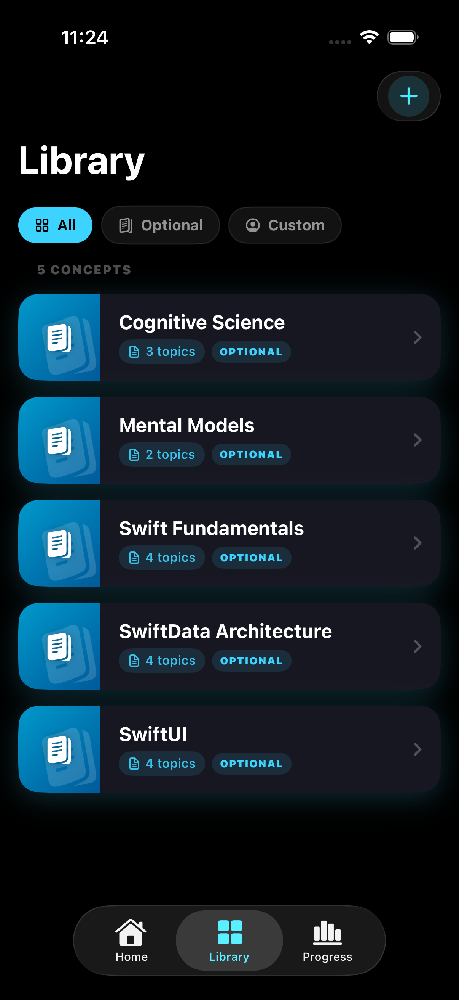

# Clarity

> **Master your learning by bridging the "Confidence-Competence" gap.**
Master your learning with Clarity. An advanced SwiftUI dashboard that identifies cognitive blind spots and improves self-awareness using real-time calibration tracking.

An iOS application built in SwiftUI that explores cognitive psychology and metacognition. By contrasting a user's perceived confidence against their actual test accuracy, the app calculates and visualizes a "Calibration Index." It shifts the focus from purely scoring high to becoming deeply self-aware of what you actually know.

## 🚀 Key Features

* **Hero Insight Card:** An expandable card UI featuring custom spring animations that dynamically shifts between bar and line graph modes to analyze user data.
* **Intelligent Calibration Mapping:** Uses a custom $gap = confidence - score$ algorithm to identify cognitive blind spots (overconfidence) and imposter syndrome (underconfidence).
* **Vision OCR Scanning:** Leverages on-device camera processing to scan physical text and test scores to auto-populate data points, ensuring a friction-free, accessible data entry experience.
* **Tactile Feedback Cues:** Distinct haptic patterns physically warn users when a dangerous calibration gap is registered.

## 🛠️ Built With

* **Language:** Swift 6 / SwiftUI
* **Persistence:** SwiftData (utilizing macro-based `@Model` and `@Query` for seamless state handling)
* **Charts:** Swift Charts (temporal and topic-specific mapping)
* **Accessibility:** VoiceOver optimization, high-contrast semantic UI, and Core Haptics.
* **AI & Vision:** Vision Framework (OCR text recognition)

## 📸 Screenshots & Demo

  

    
    
    
    
    
  

<i>← Swipe to explore the interface →</i>

https://github.com/user-attachments/assets/0340d42a-8c6b-400a-be6f-0652a8b8ccc4

## 📄 License
This project is licensed under the MIT License - see the [LICENSE](LICENSE) file for details.

